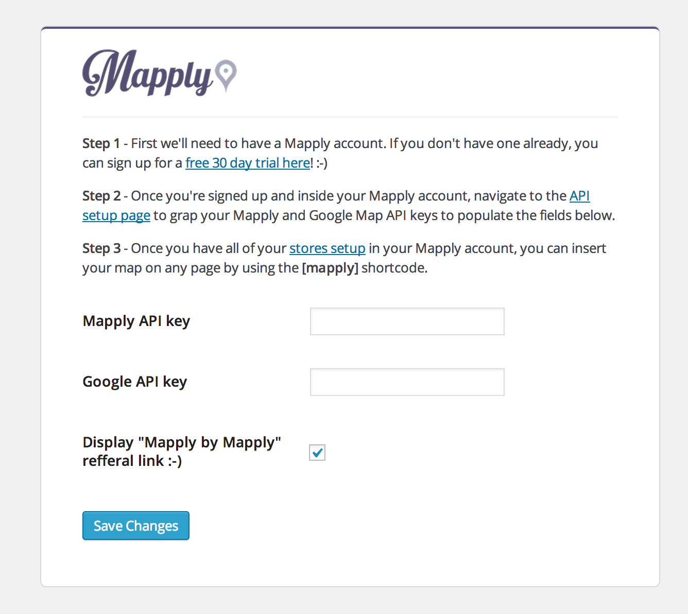
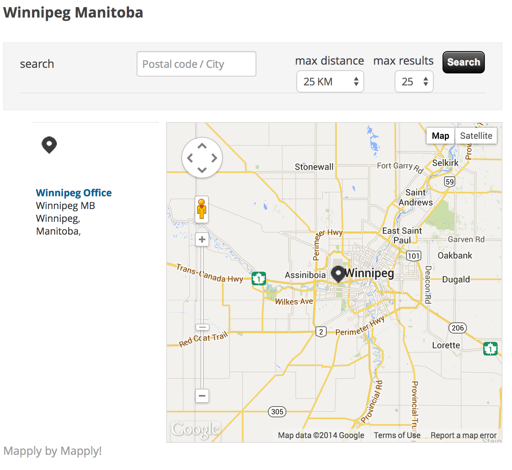

Mapply-WordPress-Plugin
=======================

A plugin that adds your mapply map to your WordPress website via shortcode. Sign up for your Mapply free trial on <a href="http://mapply.net">Mapply.net</a>. Once you have signed up you will need your API key and a Google Maps API key.

Usage
------
In order to use the Mapply WordPress plugin you will need to save your Mapply API key (found in your Mapply settings).
You will need to save these keys in the settings page in your WordPress admin dashboard.

Once saved you can use the [mapply] shortcode.

Shortcode:
<pre>
[mapply]
</pre>

Mapply will appear on your website wherever you have added the Shortcode.

Download
--------
Mapply is availble on the WordPress.org plugin directory right <a href="http://wordpress.org/plugins/mapply/">here</a>. You can download this plugin directly right <a href="https://github.com/BOLDInnovationGroup/Mapply-WordPress-Plugin/raw/master/mapply.zip">here</a>. You will need to unzip the main archive and grab mapply.zip to upload to your WordPress site through the plugin manager in the admin dashboard.

FAQ
---
<ul>
  <li><b>Q:</b>Where do I get a Mapply account?</li>
  <li><b>A:</b>You can sign up on <a href="http://mapply.net">Mapply.net</a></li>
</ul>
<ul>
  <li><b>Q:</b>Do I need the WordPress plugin to use Mapply with WordPress?</li>
  <li><b>A:</b>No, you can insert the JavaScript code directly into your website. The Shortcode is to make it easier for you.</li>
</ul>
<ul>
  <li><b>Q:</b>What is a Shortcode?</li>
  <li><b>A:</b><a href="http://codex.wordpress.org/Shortcode">Shortcodes</a> are macros supported by WordPress which make inserting code into your posts easier for you.</li>
</ul>
<ul>
  <li><b>Q:</b>Does the WordPress plugin cost anything?</li>
  <li><b>A:</b>This plugin is free with your Mapply subscription.</li>
</ul>
